## 📐 PdfLens Overview flow

```mermaid

flowchart TD

User["👤 User"]

subgraph Step1["Step 1: Provide Input"]
    Upload["📂 Upload Reference Files (PDF / DOCX / TXT, optional)"]
    Prompt["💬 Enter Prompt / Instructions"]
end

subgraph Step2["Step 2: AI Processing"]
    Context["📖 Use Uploaded Context (if any)"]
    Generate["⚙️ Generate Draft PDF (HTML Preview)"]
end

subgraph Step3["Step 3: Refine & Export"]
    Edit["📝 Edit Any Section in Preview"]
    Download["⬇️ Export Final PDF"]
end

%% Flows
User --> Upload --> Context --> Generate
User --> Prompt --> Generate
Generate --> Edit --> Download --> User

```


## 📐 PdfLens Technical Architecture

```mermaid
flowchart TD

User["User Browser"]

%% Frontend
subgraph FE["Next.js Frontend"]
    Upload["Upload File / Context"]
    Prompt["Prompt Box"]
    Preview["Editable HTML Preview"]
    Export["PDF Export"]
end

%% API Layer
subgraph API["Next.js API Layer"]
    Auth["Auth Service"]
    Metadata["User & File Metadata"]
    DB1["Relational DB (Users, Files, HTML)"]
end

%% AI Server
subgraph AI["FastAPI AI Server"]
    Ingest["Ingestion & Chunking"]
    Embeds["LangChain + Gemini Embeddings"]
    Pinecone["Pinecone Vector DB"]
    RetrieverGen["Retrieval + HTML Generation"]
    Editor["Partial Update Handler"]
end


%% Flow (Top → Bottom)
User --> Upload --> AI
User --> Prompt --> AI

AI --> Ingest --> Embeds --> Pinecone
AI --> RetrieverGen --> Pinecone
AI --> Editor --> RetrieverGen

AI --> Preview
Preview --> Export --> User

%% Metadata storage
AI -->|Store Generated HTML, File Info| API --> DB1
API --> Auth
